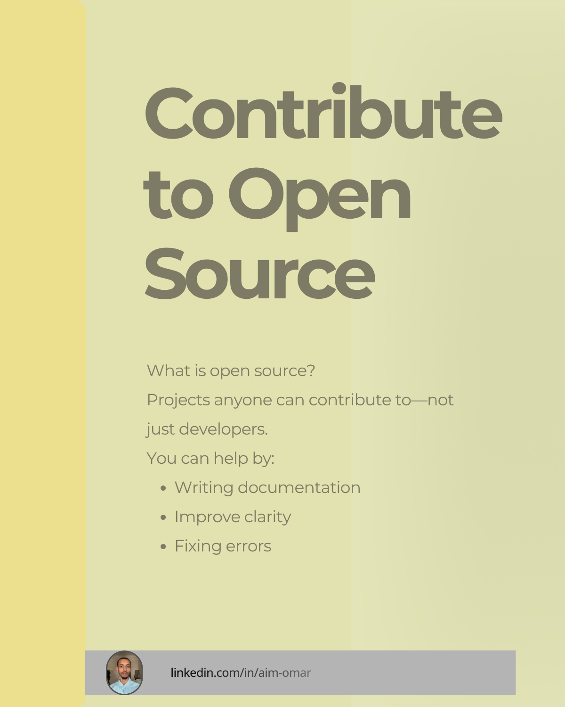

# technical-writing-portfolio-guide
Beginner-friendly guide to building a technical writing portfolio, available in English and Arabic.

This project is available in two languages:

---

## 📄 Available Versions

### 🇺🇸 English
- [Download PDF](./en/technical-writing-portfolio-beginners-en.pdf)

### 🇸🇦 Arabic (العربية)
- [تحميل الملف](./ar/technical-writing-portfolio-beginners-ar.pdf)

---

## 🧭 Overview

This guide helps beginner technical writers:

- Understand what a portfolio is  
- Create their first writing samples  
- Improve clarity and structure  
- Explore open source contributions  
- Publish and present their work  

---

## 🖼️ Preview

---

## 🛠 Tools Used

- Canva (design)
- Joplin Notes (drafting)
- GitHub (publishing)

---

## 👤 Author

Aim Omar  
Technical Writing & Localization  
https://www.linkedin.com/in/aim-omar
